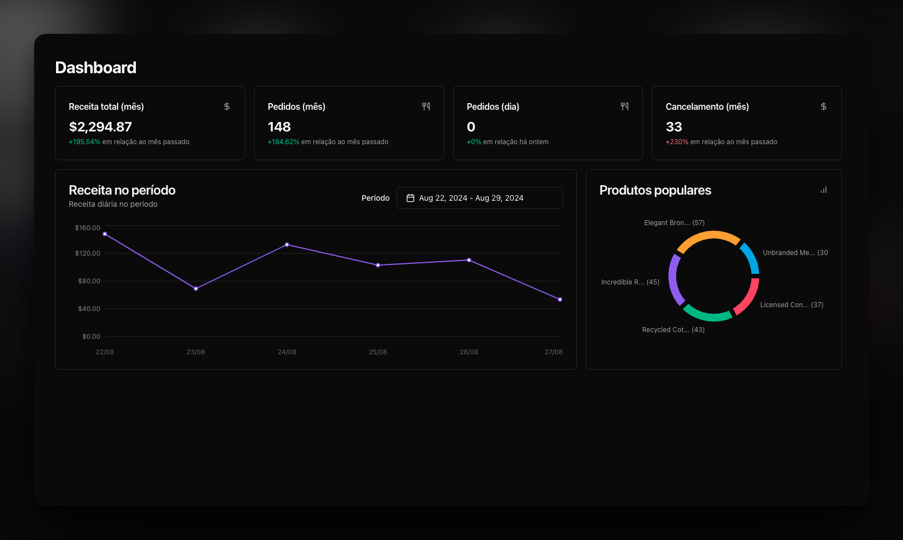

# Pizzashop Web

<h1 align="center">
  
</h1>

## About this project

This project is a dashboard designed for store owners with restaurants integrated into delivery apps. The platform allows users to monitor and analyze essential restaurant metrics. Developed with a focus on user experience, the dashboard provides valuable insights to improve operations and support strategic decision-making.

## Important Notes

- A backend server is required to access all features of this app.
- Clone the backend repository for this project [here](https://github.com/rocketseat-education/pizzashop-api) and follow the setup instructions.

## Features 
- Authentication (magic link)
- Register restaurant
- Update profile
- List orders
- Filter orders
- Filter metrics by dates
- Charts
- Approve orders
- Cancel orders
- Dispatch orders
- Deliver orders

## Getting Started

### Prerequisites

To run this project in the development mode, you'll need to install a package manager like PNPM, Npm or Yarn first, then in order to clone the project via HTTPS.

#### Cloning the repository

```bash
  $ git clone https://github.com/daniel-koti/pizzashop-web
  $ cd pizzashop-web
```

#### Install dependencies

```bash
  $ npm install
```

#### Create environment variables

Create a .env.local file and then add the following variables

```bash
  - VITE_API_URL=

  - VITE_ENABLE_API_DELAY=true
```

## Built With
- React.js
- Tailwindcss
- ShadcnUI
- Axios
- TanStack Query
- Typescript
- Rechart.js
- ESLint
- Prettier
- Zod
- React hook form

